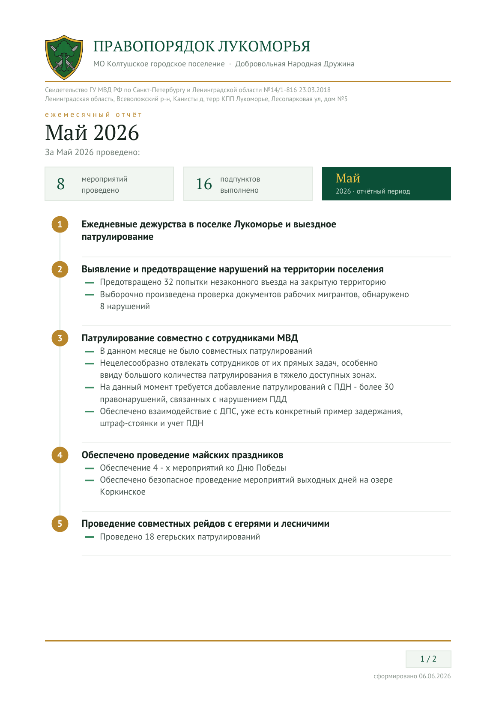

<div align="center">

# 🛡️ Отчёты ДНД

**Приложение для ежемесячных отчётов Добровольной Народной Дружины.**
Заполнили мероприятия — получили красивый PDF. Работает в браузере, без интернета, ставится как приложение.

[](https://github.com/DmitrTRC/dnd-reports/actions/workflows/ci.yml)
[](https://github.com/DmitrTRC/dnd-reports/actions/workflows/deploy.yml)
[](LICENSE)
[](CHANGELOG.md)
[](https://dmitrtrc.github.io/dnd-reports/)

### 👉 [Открыть приложение](https://dmitrtrc.github.io/dnd-reports/)



</div>

---

## 🟢 Как пользоваться (ничего устанавливать не нужно)

1. **Откройте ссылку:** **https://dmitrtrc.github.io/dnd-reports/**
   Приложение откроется прямо в браузере — это всё, что нужно для начала.

2. **Заполните отчёт:**
   - выберите месяц и год;
   - нажимайте **«＋ Пункт»** и пишите мероприятия, при необходимости добавляйте подпункты;
   - если месяц похож на прошлый — нажмите **«📋 По образцу»**, текст подставится из прошлого отчёта, останется только поправить.

3. **Получите PDF:** нажмите **«⬇ Скачать PDF»**. Файл сохранится на устройство — его можно распечатать или отправить.

4. **(по желанию) Установите как приложение,** чтобы открывалось с иконки и работало без интернета:
   - **Компьютер (Chrome / Edge):** справа в адресной строке появится значок **«Установить»** — нажмите его.
   - **iPhone (Safari):** кнопка **«Поделиться»** → **«На экран „Домой“»**.
   - **Android (Chrome):** меню **⋮** → **«Установить приложение»**.

> После первого открытия приложение работает **без интернета**. Все данные хранятся
> только на вашем устройстве.

## ✨ Что умеет

- 📄 Делает PDF-бланк прямо в браузере (офлайн), с правильной кириллицей.
- 🎨 Два стиля бланка: **Классический** (как в исходном проекте) и **Модерн** (свежий).
- 👀 Живой предпросмотр страницы — видно сразу, как будет в PDF.
- 🧩 Профили отрядов — несколько ДНД в одном приложении, у каждого свои данные, эмблема, цвета, почта и история.
- 🕓 История отчётов и заполнение «по образцу» прошлого месяца.
- ✉️ Отправка отчёта на почту (в один клик — при запущенном мини-сервере, иначе через системное «Поделиться» / почтовый клиент).
- 📲 Устанавливается как приложение (PWA), тёмная и светлая темы.

Подробное руководство по приложению и настройкам — в [dnd-report-pwa/README.md](dnd-report-pwa/README.md).

## ✉️ Отправка письма «в один клик» (по желанию)

Браузер сам не может приложить файл к письму, поэтому для отправки в один клик есть
крошечный сервер на Python (без сторонних библиотек). Подробная инструкция —
в [dnd-report-pwa/README.md](dnd-report-pwa/README.md#отправка-письма-в-один-клик-сервер).
Без него отправка тоже работает: на телефоне через «Поделиться», на компьютере —
открывается почтовая программа с готовым письмом.

---

## 👩‍💻 Для разработчиков

Приложение — статика в `dnd-report-pwa/`, без сборки и без рантайм-зависимостей
(pdf-lib, fontkit и шрифты лежат в репозитории).

```bash
git clone https://github.com/DmitrTRC/dnd-reports.git
cd dnd-reports
npm install      # dev-зависимости только для тестов
npm test         # автотесты (node:test)
npm run serve    # локальный сервер → http://localhost:8000
```

**Тесты** (`npm test`): генерация PDF в обоих стилях, пагинация вёрстки, перенос
строк, и смоук-тест интерфейса в jsdom (история, дефолты, образец, превью).

**Деплой:** автоматический. При пуше в `main` GitHub Actions публикует папку
`dnd-report-pwa` на GitHub Pages (workflow `deploy.yml`).

> ⚙️ **Разовая настройка (один раз):** в репозитории откройте
> **Settings → Pages → Build and deployment → Source** и выберите **GitHub Actions**.
> После этого каждый пуш в `main` автоматически обновляет сайт.

Структура и принципы — в [CONTRIBUTING.md](CONTRIBUTING.md), история версий — в
[CHANGELOG.md](CHANGELOG.md).

> 📦 В корне репозитория также лежит исходная консольная утилита на Python
> (`generate_report.py`, `make_report.sh`) — предшественник этого приложения.

## Лицензия

[MIT](LICENSE) © 2026 Dmitry Morozov (DmitrTRC)
